# Diagrama de Paquetes — K-QGMIP / GeoMIP

## Organización Modular del Código

El sistema se organiza en tres grandes zonas:

| Zona | Ubicación | Propósito |
|------|-----------|-----------|
| **Núcleo (Method2)** | `GeoMIP/…/Method2_Dynamic_Programming_Reformulation/` | Implementación de algoritmos de k-particiones |
| **Scripts de alto nivel** | `GeoMIP/src/` | Benchmarks, generación de resultados |
| **Soporte** | `GeoMIP/data/`, `tests/`, `docs/` | Datos, pruebas, documentación |

---

## Diagrama de Paquetes (Mermaid)

```mermaid
flowchart TD
    %% ─── ESTILOS ───────────────────────────────────────────────────────
    classDef package fill:#e8e8ff,stroke:#666,stroke-width:2px,stroke-dasharray:5 3
    classDef module  fill:#fff,stroke:#999,stroke-width:1px
    classDef strategy fill:#f9f,stroke:#c0c,stroke-width:2px
    classDef core    fill:#b0f0b0,stroke:#080,stroke-width:2px
    classDef config  fill:#ffe0b0,stroke:#a80,stroke-width:2px
    classDef data    fill:#b0d0ff,stroke:#08a,stroke-width:2px
    classDef test    fill:#ffe0e0,stroke:#c00,stroke-width:2px

    %% ═══════════════════════════════════════════════════════════════════
    %%  MÉTODO 2 — PAQUETE PRINCIPAL
    %% ═══════════════════════════════════════════════════════════════════

    subgraph M2 ["📦 Method2_Dynamic_Programming_Reformulation/"]
        direction TB

        subgraph EP ["Entry Points"]
            exec_py["exec.py<br/>(<i>iniciar()</i>)"]
            run_kpart["run_kpart.py<br/>(<i>batch k=3,4,5</i>)"]
        end

        subgraph CTRL ["src.controllers/"]
            manager["manager.py<br/>Manager (dataclass)<br/>carga TPM, rutas, genera redes"]

            subgraph STRAT ["strategies/"]
                strat_init["__init__.py<br/>exporta: BruteForce, QNodes,<br/>KQNodes, GeometricSIA,<br/>KGeoMIP, KPartitionSIA"]
                geometric["geometric.py<br/>GeometricSIA(SIA) / KGeoMIP<br/>MIP exacta k=2 (DP)"]
                kpartition["kpartition.py<br/>KPartitionSIA(SIA)<br/>k≥3: Greedy, KL, MCTS,<br/>Clustering, Espectral"]
                qnodes["q_nodes.py<br/>QNodes(SIA) / KQNodes<br/>algoritmo submodular"]
                force["force.py<br/>BruteForce(SIA)<br/>exhaustiva n≤6"]
                phi["phi.py<br/>Phi(SIA)<br/>wrapper PyPhi"]
            end
        end

        subgraph MODELS ["src.models/"]
            subgraph BASE ["base/"]
                sia["sia.py<br/>SIA(ABC) + _SUBSYSTEM_CACHE<br/>preparación de subsistemas"]
                app["application.py<br/>Application (Singleton)<br/>config global"]
            end
            subgraph CORE ["core/"]
                system["system.py<br/>System<br/>condicionar / substraer / bipartir"]
                ncube["ncube.py<br/>NCube (frozen dataclass)<br/>n-dimensional"]
                solution["solution.py<br/>Solution<br/>resultado + síntesis voz"]
            end
            subgraph ENUMS ["enums/"]
                distance["distance.py<br/>MetricDistance<br/>EMD_EFECTO, EMD_CAUSA, …"]
                notation["notation.py<br/>Notation<br/>LIL_ENDIAN, BIG_ENDIAN, …"]
            end
        end

        subgraph FUNCS ["src.funcs/"]
            base_funcs["base.py<br/>emd_efecto, emd_causal,<br/>ABECEDARY, reindexar, lil_endian"]
            system_funcs["system.py<br/>generar_candidatos,<br/>generar_subsistemas, particiones"]
            format_funcs["format.py<br/>fmt_biparticion,<br/>fmt_biparte_q, fmt_parte_q"]
        end

        subgraph CONST ["src.constants/"]
            base_const["base.py<br/>SAMPLES_PATH, LOGS_PATH,<br/>PROFILING_PATH, COLS_IDX, …"]
            models_const["models.py<br/>tags de logging por estrategia"]
            error_const["error.py<br/>mensajes de error"]
        end

        subgraph MID ["src.middlewares/"]
            slogger["slogger.py<br/>SafeLogger + ColorFormatter<br/>logs coloreados + archivo"]
            profile["profile.py<br/>ProfilingManager + ProfilerContext<br/>@profile decorator (PyInstrument)"]
        end
    end

    %% ═══════════════════════════════════════════════════════════════════
    %%  GeoMIP TOP-LEVEL SCRIPTS
    %% ═══════════════════════════════════════════════════════════════════

    subgraph GEOMIP ["📦 GeoMIP/src/"]
        benchmark["benchmark.py<br/>Benchmark exacto<br/>QNodes+Geometric+KPartition"]
        benchmark_aprox["benchmark_aprox.py<br/>Benchmark aprox (KL+MC-EMD)"]
        benchmark_rapido["benchmark_rapido.py<br/>Benchmark rápido (MCTS+MC-EMD)"]
        gen_comparativa["gen_comparativa.py<br/>genera tabla comparativa CSV"]
        run_qnodes_k2["run_qnodes_k2.py<br/>QNodes k=2"]
        tpm_io["tpm_io.py<br/>carga streaming TPM grandes<br/>float32 para n≥21"]
        geomip_paths["geomip_paths.py<br/>GEOMIP_ROOT, SAMPLES_DIR,<br/>METHOD2_ROOT"]
    end

    %% ═══════════════════════════════════════════════════════════════════
    %%  DATA / SAMPLES / RESULTS
    %% ═══════════════════════════════════════════════════════════════════

    subgraph DATA ["📁 GeoMIP/data/"]
        creation["creation.py<br/>generador redes booleanas"]
        gen_large["generate_large_tpms.py<br/>TPMs n=23-25"]
        validate["validate_tpms.py<br/>validador TPM CSV"]
        samples["samples/<br/>N10A.csv … N25B.csv<br/>(23 archivos TPM)"]
        results["results/<br/>comparativa_long.csv<br/>DatosPruebas2026*.xlsx<br/>benchmark_logs/"]
    end

    %% ═══════════════════════════════════════════════════════════════════
    %%  TESTS
    %% ═══════════════════════════════════════════════════════════════════

    subgraph TESTS ["📁 tests/ (pytest — 48+ tests)"]
        conftest["conftest.py<br/>sys.path → Method2"]
        test_emd["test_emd.py<br/>emd_efecto"]
        test_geometric["test_geometric_n3.py<br/>Cuadro 4.2 GeoMIP"]
        test_coherence["test_kpart_coherence.py<br/>consistencia k-partición"]
        test_eval["test_kpartition_eval.py<br/>evaluación particiones"]
        test_solutions["test_solutions.py<br/>validación Solution"]
    end

    %% ═══════════════════════════════════════════════════════════════════
    %%  CONFIGURATION FILES
    %% ═══════════════════════════════════════════════════════════════════

    pyproject["pyproject.toml<br/>numpy, scipy, pyphi,<br/>pyinstrument, pandas, …"]
    pyphi_config["pyphi_config.yml<br/>WELCOME_OFF: true"]

    %% ═══════════════════════════════════════════════════════════════════
    %%  DOCUMENTATION
    %% ═══════════════════════════════════════════════════════════════════

    subgraph DOCS ["📁 docs/ + Información para el Proyecto/"]
        doc_manual["Manual_Tecnico_KQMIP.md"]
        doc_usuario["Manual_Usuario_KGeoMIP.txt"]
        doc_geomip["2_GeoMIP.md"]
        doc_pruebas["DatosPruebas2026_1.md"]
        doc_proyecto["Proyecto_KQMIP.md"]
        gen_tables["gen_tables.py<br/>genera LaTeX desde Excel"]
        tables["tables/<br/>benchmark_n10.tex"]
    end

    subgraph BITACORAS ["📁 bitacoras/"]
        bit["00_indice.txt … 36 archivos<br/>diario de desarrollo"]
    end

    %% ═══════════════════════════════════════════════════════════════════
    %%  DEPENDENCIAS INTER-PAQUETE (agregadas por paquete)
    %% ═══════════════════════════════════════════════════════════════════

    %% Entry points
    exec_py                 --> manager
    run_kpart               --> manager
    run_kpart               --> geometric
    run_kpart               --> kpartition

    %% benchmarks → módulos internos
    benchmark               --> manager
    benchmark               --> geometric
    benchmark               --> kpartition
    benchmark               --> qnodes
    benchmark               --> sia
    benchmark               --> profile
    benchmark_aprox         --> manager
    benchmark_aprox         --> kpartition
    benchmark_rapido        --> manager
    benchmark_rapido        --> kpartition

    %% manager → models + constants
    manager                 --> app
    manager                 --> base_const

    %% strategies → models + funcs + constants + middlewares
    geometric               --> sia
    geometric               --> system
    geometric               --> solution
    geometric               --> manager
    geometric               --> base_funcs
    geometric               --> format_funcs
    geometric               --> base_const
    geometric               --> slogger
    geometric               --> profile
    kpartition              --> sia
    kpartition              --> system
    kpartition              --> solution
    kpartition              --> manager
    kpartition              --> geometric
    kpartition              --> base_funcs
    kpartition              --> format_funcs
    kpartition              --> base_const
    qnodes                  --> sia
    qnodes                  --> solution
    qnodes                  --> manager
    qnodes                  --> base_funcs
    qnodes                  --> format_funcs
    qnodes                  --> base_const
    qnodes                  --> slogger
    qnodes                  --> profile
    force                   --> sia
    force                   --> manager
    force                   --> system
    force                   --> solution
    force                   --> base_funcs
    force                   --> system_funcs
    force                   --> format_funcs
    force                   --> base_const
    phi                     --> sia
    phi                     --> solution
    phi                     --> manager
    phi                     --> base_funcs
    phi                     --> format_funcs
    phi                     --> distance
    phi                     --> app
    phi                     --> base_const
    phi                     --> slogger
    phi                     --> profile

    %% model core → funcs + enums + constants
    system                  --> ncube
    system                  --> base_funcs
    system                  --> notation
    system                  --> app
    system                  --> base_const
    solution                --> app
    solution                --> base_const
    sia                     --> manager
    sia                     --> system
    sia                     --> slogger
    sia                     --> base_const
    app                     --> distance
    app                     --> notation
    app                     --> base_const

    %% funcs → models + constants
    base_funcs              --> distance
    base_funcs              --> notation
    base_funcs              --> app
    base_funcs              --> base_const
    format_funcs            --> base_funcs
    format_funcs            --> base_const

    %% middlewares → models + constants
    slogger                 --> base_const
    profile                 --> app
    profile                 --> base_const

    %% tests → módulos internos
    test_emd              --> base_funcs
    test_geometric        --> geometric
    test_geometric        --> manager
    test_coherence        --> kpartition
    test_coherence        --> manager
    test_eval             --> kpartition
    test_eval             --> manager
    test_solutions        --> qnodes
    test_solutions        --> geometric
    test_solutions        --> kpartition

    %% data utilities → samples
    creation                --> samples
    gen_large               --> samples
    validate                --> samples

    %% generación de tablas → results
    gen_tables              --> results

    %% archivos de configuración (asociación lateral)
    pyproject               -.-> M2
    pyphi_config            -.-> M2

    %% ═══════════════════════════════════════════════════════════════════
    %%  LEYENDA
    %% ═══════════════════════════════════════════════════════════════════

    subgraph LEGEND [Leyenda]
        L1[" "]:::strategy
        L1_txt["Estrategias SIA (heredan de SIA)"]

        L2[" "]:::core
        L2_txt["Núcleo (modelo de dominio)"]

        L3[" "]:::config
        L3_txt["Archivos de configuración"]

        L4[" "]:::data
        L4_txt["Datos (TPMs, resultados)"]

        L5[" "]:::test
        L5_txt["Tests pytest"]
    end
```

---

## Dependencias entre Paquetes (resumen)

| Paquete | Depende de | Naturaleza |
|---------|-----------|-----------|
| `controllers.strategies` | `controllers.manager`, `models.base.sia`, `models.core.{system,solution}`, `funcs.{base,format}`, `middlewares.{slogger,profile}`, `constants.{base,models}` | Cada estrategia importa `SIA`, `System`, `Solution`, `Manager`, funciones EMD y logging |
| `controllers.manager` | `models.base.application`, `constants.base` | Manager lee el Singleton y las constantes de ruta |
| `models.base.sia` | `controllers.manager`, `models.core.system`, `middlewares.slogger`, `constants.{base,error,models}` | SIA recibe Manager por constructor y prepara subsistemas |
| `models.core.system` | `models.core.ncube`, `models.enums.notation`, `models.base.application`, `funcs.base`, `constants.base` | System compone NCubes y usa funciones de reindexación |
| `models.core.solution` | `models.base.application`, `constants.base` | Solution solo necesita el Singleton para formateo |
| `models.core.ncube` | *(ninguno)* | Frozen dataclass autónomo — **hoja** |
| `funcs.base` | `models.enums.{distance,notation}`, `models.base.application`, `constants.base` | EMD y utilidades matemáticas |
| `funcs.system` | *(ninguno)* | Generación de combinaciones — **hoja** |
| `funcs.format` | `funcs.base`, `constants.base` | Formateo de particiones |
| `middlewares.slogger` | `constants.base` | Solo rutas de logging |
| `middlewares.profile` | `models.base.application`, `constants.base` | Singleton + rutas |
| `constants.*` | *(ninguno)* | Definiciones simples — **hojas** |
| `benchmark.py` | geomip_paths, `controllers.{manager,strategies.*}`, `models.base.sia`, `middlewares.profile` | Orquestación completa |
| `tests/*` | Method2 completo y `pytest` | Validación por estrategia |

**Módulos hoja** (sin dependencias internas):
- `models/enums/notation.py`
- `models/enums/distance.py`
- `models/core/ncube.py`
- `funcs/system.py`
- `constants/base.py`
- `constants/models.py`
- `constants/error.py`

---

## Ubicación de Archivos Clave

### Archivos de Configuración
| Archivo | Ruta | Contenido |
|---------|------|-----------|
| `pyproject.toml` | `Method2/…/pyproject.toml` | Dependencias: numpy, scipy, pyphi, pyinstrument, pandas, openpyxl, pyttsx3, colorama |
| `pyphi_config.yml` | `Method2/…/pyphi_config.yml` | Config PyPhi (`WELCOME_OFF: true`) |

### Tests
| Archivo | Ruta | Tests |
|---------|------|-------|
| `conftest.py` | `tests/conftest.py` | Configuración (sys.path) |
| `test_emd.py` | `tests/test_emd.py` | `emd_efecto` con ejemplos documentados |
| `test_geometric_n3.py` | `tests/test_geometric_n3.py` | Cuadro 4.2 de 2_GeoMIP.md (N3C) |
| `test_kpart_coherence.py` | `tests/test_kpart_coherence.py` | Consistencia: k=3 ≤ k=2, metadata en Solution |
| `test_kpartition_eval.py` | `tests/test_kpartition_eval.py` | KPartitionSIA(k=2) == GeometricSIA, evaluación |
| `test_solutions.py` | `tests/test_solutions.py` | Validación de objetos Solution (4 estrategias) |

### Documentación
| Archivo | Ruta |
|---------|------|
| `Manual_Tecnico_KQMIP.md` | `Información para el Proyecto/Manual_Tecnico_KQMIP.md` |
| `Proyecto_KQMIP.md` | `Información para el Proyecto/Proyecto_KQMIP.md` |
| `2_GeoMIP.md` | `Información para el Proyecto/2_GeoMIP.md` |
| `DatosPruebas2026_1.md` | `Información para el Proyecto/DatosPruebas2026_1.md` |
| `Manual_Usuario_KGeoMIP.txt` | `docs/Manual_Usuario_KGeoMIP.txt` |
| `README.md` | Raíz del proyecto |
| `gen_tables.py` | `docs/gen_tables.py` (genera LaTeX desde Excel) |

---

## Notas Arquitectónicas

1. **Strategy Pattern**: el paquete `strategies/` contiene 5 implementaciones concretas de `SIA(ABC)` intercambiables.
2. **KPartitionSIA compone GeometricSIA**: para k=2 delega, para k≥3 reutiliza `find_mip()` y `tabla_transiciones` como semilla.
3. **NCube es frozen**: todas las operaciones (`condicionar`, `marginalizar`) retornan nuevas instancias.
4. **Cachés**: `_SUBSYSTEM_CACHE` (en sia.py) y `_FIND_MIP_CACHE` (en geometric.py) evitan recalcular subsistemas O(2ⁿ) entre estrategias.
5. **El Singleton `aplicacion`** es accesible desde toda la aplicación (`from src.models.base.application import aplicacion`).
